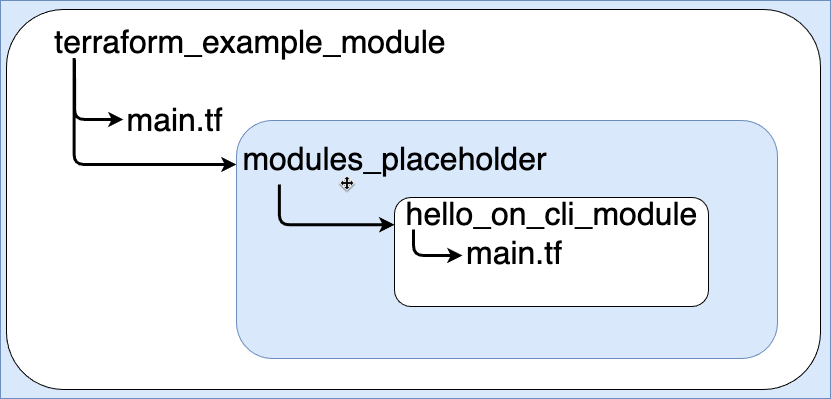

# What is a module
A module is unit of code that can be used again and again.

## A module
- Is a portion of code that performs a specific task
- Can be loaded from a larger application
- oversimplified, think of a module as a lego unit that can be used to create bigger toys

## Modules should be:
- Independent
    - As much as possible should not depend on other pieces of code
- Specific
    - Needs to do one thing, as much as possible
- Reusable
    - Has to be easy to integrate into bigger applications

# Create a module
In the current directory of your project create main.tf
```
touch main.tf
```
In the main.tf add following content. \ 
This will load the module that prints "Hello World!" on the cli. \
_Module and directory structure will be created in following steps._
```
module "sum_two_numbers" {
    source = "./modules_placeholder/hello_on_cli_module"
}
```

Create a directory named modules_placeholder. \ 
This directory will contain one or more module directories.
```
mkdir modules_placeholder
```

cd into the modules_placeholder and create a new directory called hello_on_cli_module.
```
cd modules_placeholder && mkdir hello_on_cli_module
```

Create a new terraform file that will contain code that prints "Hello World!" on the cli.
```
touch main.tf
```

Add this code that prints "Hello World!":
```
resource "null_resource" "print_on_cli_hello_world" {
  provisioner "local-exec" {
    command = "echo Hello World!"
  }
}
# in bellow comment is the expected output after it's loaded and run
# module.name.null_resource.fake_resource (local-exec): Hello World!
```

Change directory back to the top of your project:
```
cd ../../
```

Make sure you see this directory structure:
```
tree
```
```
$ tree
├── main.tf
├── module_placeholder
│   └── hello_on_cli_module
│       └── main.tf
```

Initialize the directory using terraform init:
```
terraform init
```

Tell terraform to create and display the plan on how it's going to print "Hello World!" on the cli:
```
terraform plan
```

Apply the changes if the plan looks good:
```
terraform apply
```

## Directory structure
To use a module means load another file from another directory


